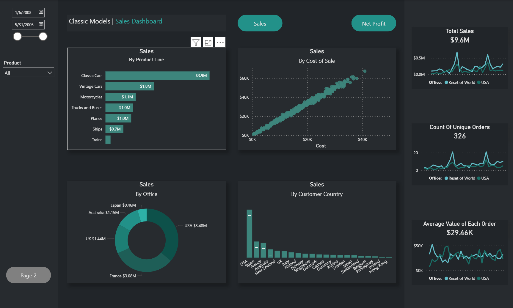
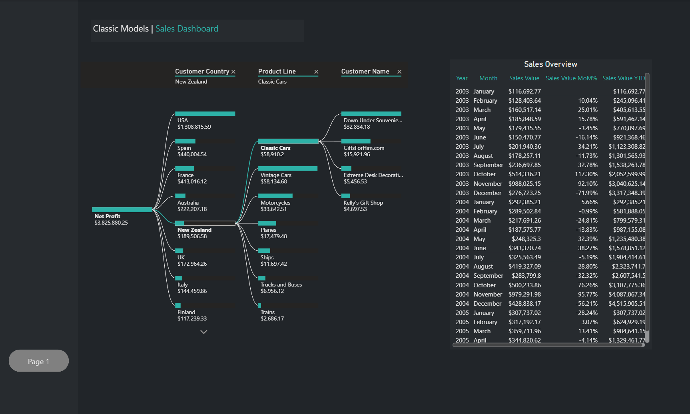

# 📊 Classic Model Sales Dashboard Analysis

## 📌 Deskripsi Project
Project ini merupakan dashboard analisis penjualan menggunakan **Power BI** dengan dataset **Classic Model Sales**. Dashboard dirancang untuk membantu memantau performa penjualan dan profit perusahaan melalui visualisasi interaktif dan KPI bisnis.

Dashboard menampilkan:
- Monthly Sales Trend
- Month-over-Month (% Change)
- Total Sales
- Net Profit
- Toggle button untuk berpindah antara tampilan Sales dan Net Profit
- Visualisasi interaktif menggunakan berbagai chart

Project ini bertujuan untuk membantu stakeholder memahami performa bisnis, tren penjualan, profitabilitas, serta perilaku pelanggan berdasarkan data historis penjualan.

---

# 📷 Dashboard Preview

## Sales Overview - Page 1



---

## Sales Overview - Page 2



---

## 🎯 Tujuan Project
- Memonitor performa penjualan bulanan perusahaan.
- Menganalisis perubahan penjualan dari bulan ke bulan (MoM Change).
- Mengidentifikasi produk dan product line dengan kontribusi tertinggi.
- Menganalisis profitabilitas berdasarkan customer dan wilayah.
- Membantu pengambilan keputusan bisnis berbasis data.

---

## 🗂️ Dataset Information

Dataset terdiri dari beberapa kolom utama:

| Kolom | Deskripsi |
|---|---|
| orderDate | Tanggal pemesanan |
| orderNumber | Nomor order |
| productName | Nama produk |
| productLine | Kategori produk |
| customerName | Nama customer |
| customer_country | Negara customer |
| office_country | Negara kantor/office |
| buyPrice | Harga beli produk |
| priceEach | Harga jual per unit |
| quantityOrdered | Jumlah produk yang dipesan |
| sales_value | Total nilai penjualan |
| cost_of_sales | Total biaya penjualan |

---

## 🛠️ Tools & Technologies
- Power BI
- SQL / MySQL
- Power Query
- DAX (Data Analysis Expressions)

---

## 📈 Dashboard Features

### ✅ KPI Cards
Dashboard menampilkan KPI utama seperti:
- Total Sales
- Net Profit
- Monthly Sales
- MoM % Change

---

### ✅ Interactive Button
Terdapat tombol interaktif untuk:
- Switch antara tampilan **Sales**
- dan **Net Profit**

Hal ini membantu pengguna melakukan analisis secara lebih fleksibel dalam satu dashboard.

---

## 📊 Visualisasi yang Digunakan

| Visual | Fungsi |
|---|---|
| KPI Chart | Menampilkan metrik utama bisnis |
| Line Chart | Analisis tren penjualan bulanan |
| Column Chart | Perbandingan sales antar kategori |
| Donut Chart | Distribusi kontribusi product line |
| Bar Chart | Perbandingan performa customer/negara |
| Scatter Plot | Analisis hubungan sales dan profit |

---

# 📌 Business Insight

## 1. Tren Penjualan Bulanan
Analisis line chart menunjukkan bahwa penjualan mengalami fluktuasi setiap bulan. Terdapat beberapa periode dengan peningkatan signifikan yang mengindikasikan adanya seasonal demand atau peningkatan aktivitas pembelian customer.

### Insight:
- Perusahaan dapat memanfaatkan periode peak season untuk meningkatkan strategi marketing dan inventory planning.
- Penurunan penjualan pada bulan tertentu dapat dijadikan evaluasi promosi atau strategi distribusi.

---

## 2. Product Line dengan Kontribusi Tertinggi
Berdasarkan donut chart dan column chart, beberapa product line memberikan kontribusi sales yang jauh lebih besar dibanding kategori lainnya.

### Insight:
- Product line dengan sales tertinggi dapat dijadikan fokus utama bisnis.
- Product line dengan performa rendah memerlukan evaluasi harga, promosi, atau positioning produk.

---

## 3. Analisis Net Profit
Dashboard menunjukkan bahwa tingginya sales tidak selalu menghasilkan net profit yang tinggi. Hal ini dipengaruhi oleh:
- cost of sales
- margin produk
- quantity ordered

### Insight:
- Produk dengan margin profit tinggi lebih penting dibanding hanya volume penjualan besar.
- Strategi pricing dan cost efficiency perlu ditingkatkan untuk meningkatkan profitabilitas.

---

## 4. Customer dan Negara dengan Kontribusi Terbesar
Bar chart menunjukkan adanya customer dan negara tertentu yang mendominasi transaksi penjualan.

### Insight:
- Customer dengan kontribusi tinggi dapat dijadikan target loyalty program.
- Negara dengan sales rendah dapat menjadi peluang ekspansi atau evaluasi strategi pasar.

---

## 5. Hubungan Sales dan Quantity Ordered
Scatter plot menunjukkan hubungan antara jumlah order dan nilai sales.

### Insight:
- Order quantity yang tinggi cenderung menghasilkan sales lebih besar.
- Namun beberapa transaksi dengan quantity kecil tetap menghasilkan profit tinggi karena margin produk lebih besar.

---

# 📌 Kesimpulan
Dashboard ini membantu proses monitoring performa bisnis secara interaktif dan real-time melalui visualisasi data yang informatif.

Melalui dashboard ini, stakeholder dapat:
- memahami tren penjualan,
- mengevaluasi profitabilitas,
- mengidentifikasi product line terbaik,
- serta mengambil keputusan bisnis berbasis data dengan lebih efektif.

---

# 📂 Struktur Project

```bash
Classic-Model/
│
├── dataset/
│   ├── classic_model_sales.csv
│
├── dashboard/
│   ├── classic_model_dashboard.pbix
│
├── images/
│   ├── dashboard_overview.png
│   ├── sales_profit_analysis.png
│
├── README.md
